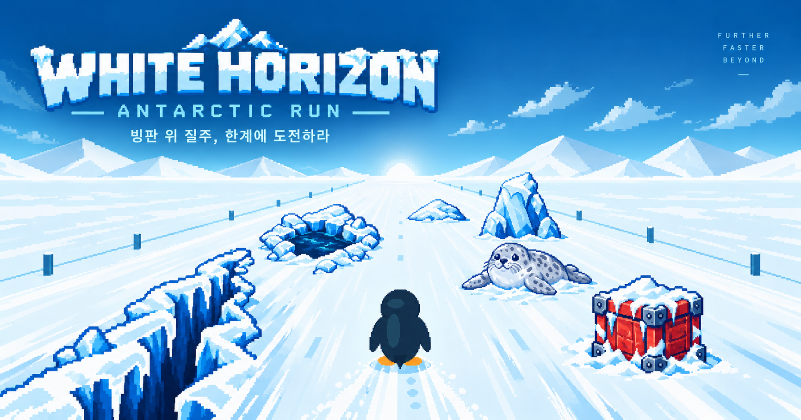

# WHITE HORIZON / ANTARCTIC RUN

**하얀 대륙 위에, 나만의 기록을 남기세요.**



작은 펭귄과 함께 남극을 달리는 **브라우저 아케이드 러닝 게임**입니다. Antarctic Adventure 계열의 탐험·레이싱 감각을 웹에서 재해석했습니다. 지평선 너머에서 다가오는 장애물을 피하고, 속도를 높이고, 점프하며 더 먼 거리와 높은 SCORE에 도전하세요.

Phaser의 2D 렌더링과 원근 계산으로 전방 스크롤을 구현했으며, PC 키보드·게임패드·모바일 터치를 지원합니다. 현재 **클래식 모드**를 플레이할 수 있고, 메뉴의 시선추적 모드는 개발 중입니다.

[주요 기능](#주요-기능) · [조작법](#조작법) · [기술 스택](#기술-스택) · [개발 문서](#개발-문서)

## 주요 기능

- **끝없이 달리는 거리 기록 모드** — 14m/s로 출발해 주행할수록 조금씩 빨라집니다. 직접 가속해 더 높은 기록에 도전할 수 있으며 속도 상한은 없습니다.
- **13종의 남극 장애물** — 눈더미, 크레바스, 잠자는 물개부터 코스 전체를 가로막는 바리케이드까지, 폭과 배치에 맞춰 이동하거나 점프합니다.
- **고스트 펭귄 아이템** — 획득하면 10초 동안 장애물을 통과합니다. 효과가 끝나기 전에는 남은 시간을 표시합니다.
- **10개의 랜드마크** — 펭귄 군락, 얼음 동굴, 남극 전진기지 등 10~100km 구간의 목적지를 만납니다. 도착하면 펭귄이 돌아서 축하한 뒤 다시 달립니다.
- **최고 기록과 온라인 랭킹** — 브라우저에 최장 거리를 보관하고, 원하는 주행 결과를 온라인에 등록해 상위 100명과 내 순위를 확인합니다.
- **다양한 입력과 화면 지원** — 키보드·게임패드를 자유롭게 전환하고, 모바일에서는 이동과 점프를 동시에 터치할 수 있습니다.
- **BGM과 일시정지** — 메뉴·게임 음악과 음소거 설정을 제공하며, 다른 창이나 탭으로 이동하면 주행과 음악을 함께 멈춥니다.

## 플레이 방법

```text
BGM 선택 → 닉네임 설정 → 메인 메뉴 → 클래식 버전
→ 이동·가속·점프 → 장애물 회피·아이템 획득 → 랜드마크 도착·재출발
→ 충돌 시 게임오버 → 기록 확인·온라인 저장 → 다시 도전
```

처음 50m는 장애물 없이 시작합니다. 주행 중 기본 속도는 1분마다 **0.6m/s**씩 증가하고, 가속·감속을 **누르는 동안 초당 8m/s**씩 부드럽게 조절됩니다. 손을 놓으면 수동 가속분을 유지하며 기본 속도 증가만 이어집니다. 감속은 현재 기본 속도까지만 가능하며, 일시정지와 랜드마크 축하 중에는 기본 속도가 증가하지 않습니다. 재도전하면 14m/s로 초기화합니다.

장애물은 7개 레인에 배치되고 펭귄은 좌우로 연속 이동합니다. 고스트 효과가 없는 상태에서 장애물에 닿으면 즉시 게임오버입니다.

| 점유 폭 | 장애물 |
| --- | --- |
| 1칸 | 눈더미, 보급 상자, 빙설 바위, 해빙 구멍, 얼음 송곳, 연료 드럼통, 빙판 |
| 인접 2칸 | 크레바스, 잠자는 물개, 부서진 썰매, 추락 안테나, 방풍 울타리 |
| 전체 폭 | 바리케이드 — 좌우 우회가 불가능하므로 점프로 통과 |

점프 시간은 모든 속도에서 **0.8초**입니다. 착지 직전 0.12초 안에 점프를 새로 누르면 착지 후 이어서 점프하며, 버튼을 누른 채로 자동 반복하지 않습니다. 고스트 아이템은 기본 3~4km 간격으로 생성되고, 장애물이나 랜드마크 안전 구간과 겹치면 더 뒤에 배치됩니다.

랜드마크는 10km 간격으로 총 10개가 등장합니다. 도착하면 2.5초간 축하한 뒤 같은 선택 속도로 재출발하고, 마지막 100km 랜드마크 이후에도 주행을 계속합니다.

## 조작법

| 동작 | 키보드 | 표준 게임패드 |
| --- | --- | --- |
| 좌우 이동 | ← / → 또는 A / D | 왼쪽 스틱 좌우, D-pad 좌우 |
| 가속 | ↑ 또는 W | 왼쪽 스틱 위, D-pad 위 |
| 감속 | ↓ 또는 S | 왼쪽 스틱 아래, D-pad 아래 |
| 점프 | Space | 남쪽 버튼: Xbox A / PlayStation Cross |
| 일시정지 / 계속하기 | Escape 또는 HUD 버튼 | Menu / Start |
| 게임오버 후 재도전 | 다시 도전 버튼 또는 새 Space 입력 | 새 남쪽 버튼 입력 |

게임 화면을 클릭하거나 Tab으로 선택하면 키보드로 조작할 수 있습니다. 방향키·스틱·D-pad·터치 버튼을 누르는 동안 계속 가감속합니다. 게임패드가 인식되지 않으면 연결 후 버튼을 한 번 눌러주세요.

모바일·태블릿에서는 화면 하단 양끝의 반투명 터치 버튼을 사용합니다. 왼쪽에는 이동·점프·감속, 오른쪽에는 이동·점프·가속 버튼이 표시됩니다. 세로로 긴 화면은 게임·HUD·버튼을 함께 90도 회전해 가로 배치로 보여주며, 화면 크기가 바뀌어도 진행 중인 주행을 유지합니다.

다른 창·탭으로 이동하면 게임 전체가 자동으로 멈춥니다. 직접 일시정지한 경우에는 창으로 돌아온 뒤에도 계속하기를 눌러야 재개됩니다. 같은 페이지에서 게임 영역 밖으로 포커스만 이동하면 입력을 해제하고 자동 전진은 계속합니다.

## 점수와 랭킹

```text
SCORE = round(정수 전진 거리(m) × 평균 속도(m/s) ÷ 14)
STAGE = 완료한 랜드마크 수 + 1
```

평균 속도는 실제 이동 거리를 실제 주행 시간으로 나눠 계산합니다. 일시정지·창 이탈·랜드마크 축하 시간은 제외하며, 주행 중에는 예상 SCORE를 표시하고 게임오버 순간에 확정합니다. 예를 들어 평균 28m/s로 1,000m를 달리면 2,000점입니다.

| 구분 | 저장 방식 | 기준 |
| --- | --- | --- |
| 브라우저 최고 기록 | 게임오버 시 자동 저장 | 최장 거리와 그 주행의 평균 속도 |
| 온라인 랭킹 | 결과 화면에서 **내 기록 저장하기** 선택 | 플레이어별 최고 SCORE 한 개, 상위 100명과 본인 순위 |

닉네임과 플레이어 ID는 현재 브라우저에 저장됩니다. 닉네임을 바꿔도 ID는 유지되며, 이미 등록한 기록의 이름은 변경되지 않습니다. 같은 주행 결과를 여러 번 저장해도 중복 등록하지 않습니다.

## 기술 스택

| 영역 | 사용 기술 |
| --- | --- |
| 웹 앱 | Next.js 16.3 · React 19.2 · App Router |
| 게임 | Phaser 4.2 · 의사 3D 원근 투영 |
| 언어·스타일 | TypeScript · Tailwind CSS 4 · CSS Modules |
| 기록 서버 | Next.js Route Handlers · Supabase |
| 개발·검증 | pnpm · ESLint · Node.js 내장 테스트 러너 |

## 검증 범위

자동 테스트는 입력 병합, 점프, 장애물 배치·충돌, 아이템, 랜드마크, 기록·랭킹, 게임 생성·해제를 다룹니다. 상세 검증 기록은 [QA 점검 결과](docs/QA_REVIEW.md)와 [13종 장애물 확장 보고](docs/OBSTACLE_EXPANSION_REPORT.md)에 있습니다. 게임패드 자동 테스트는 모의 입력을 사용하며, 실제 컨트롤러와 실물 모바일 기기의 검증 범위는 각 보고서를 참고하세요.

## 프로젝트 구조

```text
src/
├── app/                 # 페이지, 레이아웃, 메타데이터, 기록·랭킹 API
├── components/game/     # 메뉴, HUD, 결과·랭킹 화면, 터치 UI, Phaser 마운트
├── game/
│   ├── config/          # 속도·점프·해상도·오디오 설정
│   ├── data/            # 장애물·아이템·랜드마크 정의
│   ├── entities/        # 펭귄 상태와 렌더링
│   ├── input/           # 키보드·게임패드·터치 통합 입력
│   ├── scenes/          # 에셋 로딩과 게임 루프
│   ├── systems/         # 원근·생성·충돌·주행·기록·BGM
│   ├── types/           # 게임과 기록 타입
│   └── utils/           # 거리 표시와 식별자 유틸리티
└── server/              # 기록 검증, 저장·순위 서비스, Supabase 접근
public/
├── asset/               # 장애물·아이템·랜드마크 이미지와 BGM
└── og.png               # 대표 이미지
supabase/                # 기록 테이블·랭킹 뷰·접근 권한 SQL
docs/                    # 기능 설계와 검증 기록
```

**React는 화면과 게임의 수명 주기, Phaser는 시뮬레이션과 렌더링을 담당합니다.** 메인 메뉴에서는 Phaser를 생성하지 않고 클래식 진입 시 브라우저에서 동적으로 로드합니다. 메뉴로 돌아오면 게임을 해제하며, React HUD에는 최대 10Hz로 상태 스냅샷을 전달합니다.

키보드·게임패드·터치는 `InputManager`에서 하나의 입력으로 합칩니다. 장애물의 그림·충돌·아이템 배치는 같은 점유 레인 정보를 사용하고, 원근 계산은 `PerspectiveSystem`으로 모읍니다. 속도·점프 등 밸런스는 [constants.ts](src/game/config/constants.ts)에서 조정합니다.

## 개발 문서

| 문서 | 내용 |
| --- | --- |
| [프로젝트 작업 지침](AGENTS.md) | 구현 방향, 계층별 책임, 작업·검증 기준 |
| [메뉴 흐름](docs/MENU_FLOW_PLAN.md) | 메뉴·게임·일시정지 전환과 게임 수명 주기 |
| [거리 기록 모드](docs/ENDLESS_RUN_PLAN.md) | 자동 전진, 점수, 충돌, 재시작 |
| [장애물 사양](docs/OBSTACLE_ASSETS_PLAN.md) | 현재 13종 장애물의 점유·생성·회피 규칙 |
| [아이템 시스템](docs/ITEM_SYSTEM.md) | 고스트 펭귄 생성·획득·효과 처리 |
| [랭킹 설계](docs/RANKING_PLAN.md) | 플레이어, 기록 저장, 점수와 순위 |
| [QA 점검 결과](docs/QA_REVIEW.md) | 자동·브라우저 검증 기록과 남은 확인 사항 |
| [고속 점프 검증](docs/HIGH_SPEED_JUMP_REVIEW.md) | 고속 주행에서의 점프·충돌 회귀 검증 |
| [장애물 확장 보고](docs/OBSTACLE_EXPANSION_REPORT.md) | 13종 통합과 검증 결과 |
| [구현 계획](docs/IMPLEMENTATION_PLAN.md) | 단계별 구현 기록 |
| [코스 확장 계획](docs/COURSE_EVOLUTION_PLAN.md) | 코스·랜드마크 후속 설계 |

설계 문서에는 이전 사양과 후속 계획이 함께 남아 있습니다. 현재 장애물 동작은 장애물 사양 문서의 **현재 최종 사양** 절을 기준으로 합니다.

---

Developed by [James](https://github.com/James940522) · Repository: `antarctic-adventure-web`
